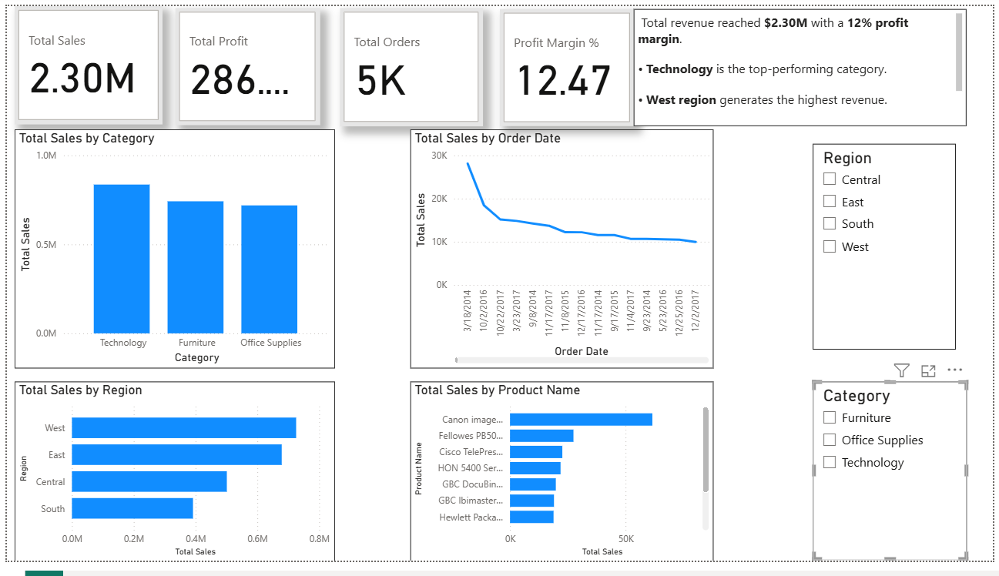

# 📊 Business Sales Performance Analytics Dashboard

## 📌 Project Overview
This project analyzes business sales data using Power BI to identify revenue trends, profitable categories, regional performance, and top-selling products.

---

## 🛠 Tools Used
- Power BI  
- Superstore Dataset  

---

## 🔍 Business Questions & Findings

### 1️⃣ Which products generate the most revenue?
The top 10 products contribute significantly to overall revenue.

### 2️⃣ How do sales change over time?
Monthly revenue trends show fluctuations, indicating possible seasonal demand patterns.

### 3️⃣ Which categories or regions are most profitable?
Technology is the highest-performing category.  
West region generates the highest revenue.

### 4️⃣ Where should the business focus to grow faster?
The business should:
- Focus on high-performing categories
- Improve low-performing regions
- Maintain stock of top-selling products

---

## 📈 Key KPIs
- Total Revenue: $2.30M  
- Total Profit: $286K  
- Profit Margin: 12%  
- Total Orders: 5K  

---

## 📷 Dashboard Preview

